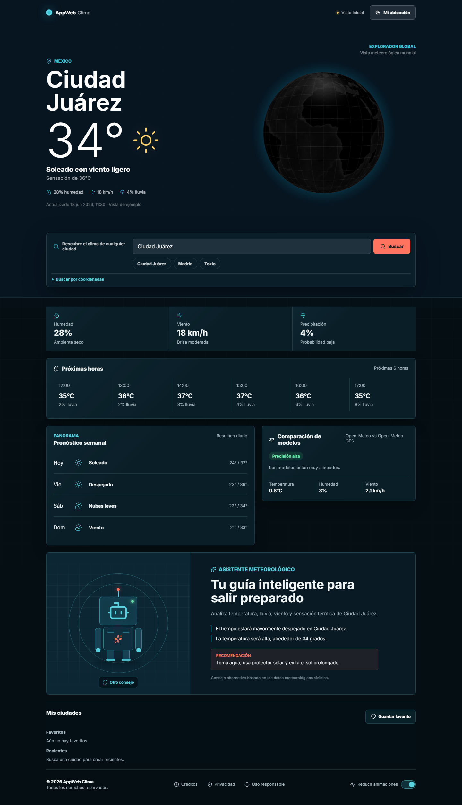
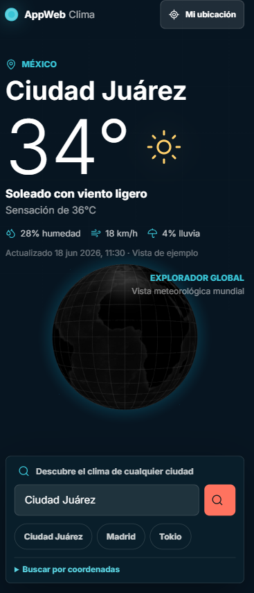
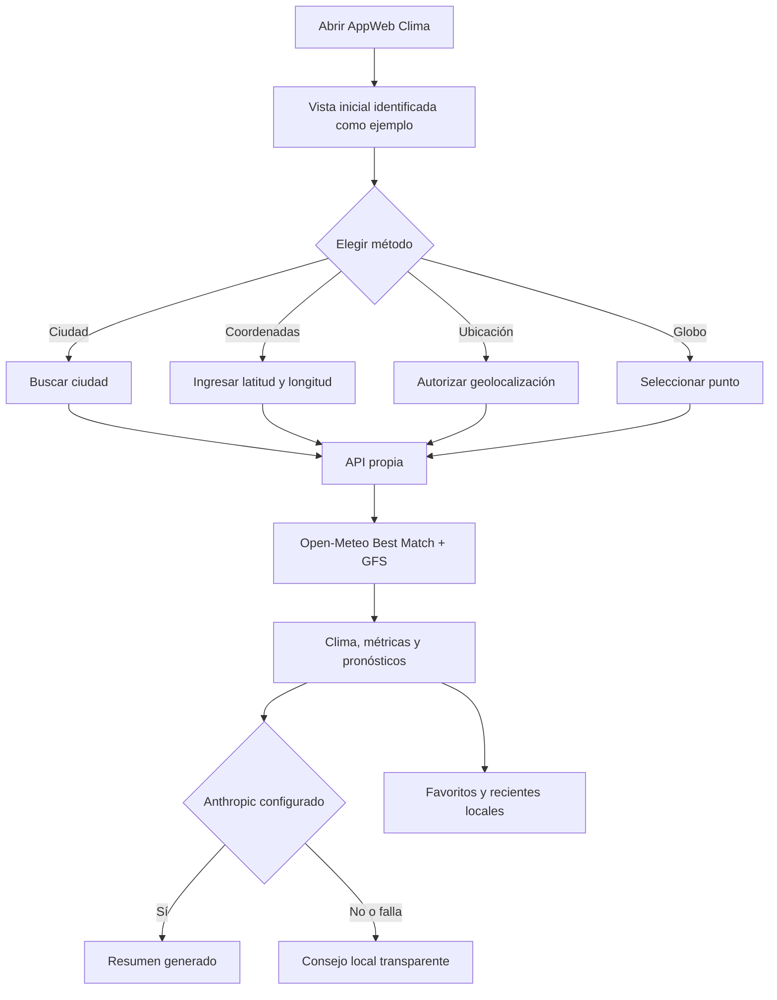
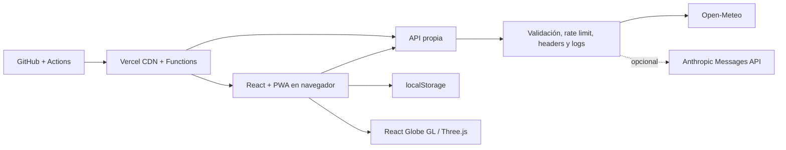
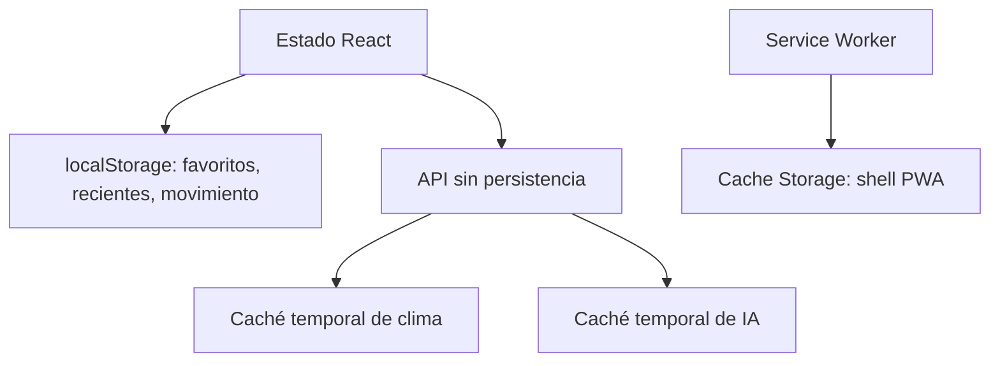

# AppWeb Clima

[](https://github.com/MauricioMurcia293847/AppWeb-Clima/actions/workflows/ci.yml)
[](https://app-web-clima-kappa.vercel.app/)
[](LICENSE)

Dashboard meteorológico visual, accesible y responsive. Permite consultar ciudades, coordenadas o la ubicación del dispositivo; explora el planeta con un globo 3D, compara dos modelos de Open-Meteo y ofrece recomendaciones mediante Anthropic o una guía local degradable.

**Demo:** [app-web-clima-kappa.vercel.app](https://app-web-clima-kappa.vercel.app/)

## Características

- Clima actual y pronóstico por ciudad, coordenadas o geolocalización.
- Globo 3D interactivo con fallback estático cuando WebGL no está disponible.
- Comparación honesta entre Open-Meteo Best Match y Open-Meteo GFS.
- Asistente meteorológico animado con Anthropic opcional y respaldo determinista.
- Estados diferenciados para datos en vivo, ejemplo, respaldo, rate limit y error.
- Favoritos, búsquedas recientes y preferencia de movimiento en `localStorage`.
- Borrado selectivo y confirmado de los datos locales de la aplicación.
- Diseño oscuro responsive con foco visible y soporte para movimiento reducido.
- PWA instalable con shell offline, sin presentar clima almacenado como actual.
- API propia para ocultar secretos, validar entradas y normalizar proveedores.
- CI con lint, Vitest, build, presupuestos, PWA y Playwright multinavegador.

## Capturas

### Escritorio



### Móvil



Las capturas se generan desde la aplicación real con:

```bash
npm run docs:screenshots
```

## Flujo de usuario



## Arquitectura



En desarrollo, Express sirve la API en `127.0.0.1:3001`. En producción, Vercel ejecuta adaptadores serverless bajo `/api/*`. Ambos consumen los mismos casos de uso y contratos HTTP.

## Stack técnico

| Capa | Tecnología | Responsabilidad |
|---|---|---|
| Frontend | React 19 + TypeScript | Estado, componentes y accesibilidad |
| Build | Vite 7 | Desarrollo, bundles y recursos |
| Estilos | CSS propio + Inter local | Sistema visual oscuro y responsive |
| 3D | React Globe GL + Three.js | Globo, cámara y selección espacial |
| Animación | Anime.js | Interacciones diferidas del asistente |
| API local | Node.js + Express 5 | Desarrollo y contratos HTTP |
| API producción | Vercel Functions | Endpoints serverless del mismo dominio |
| Clima | Open-Meteo | Geocoding, forecast y comparación de modelos |
| IA opcional | Anthropic Messages API | Resumen meteorológico estructurado |
| PWA | Vite PWA + Workbox | Instalación y shell offline |
| Calidad | ESLint, Vitest, Supertest, Playwright y axe-core | Validación automática |
| CI/CD | GitHub Actions + Vercel | Gates y despliegue |

## Estructura de carpetas

```text
AppWeb Clima/
|-- api/                    # Adaptadores serverless de Vercel
|   `-- weather/            # Clima actual, búsqueda y resumen IA
|-- docs/                   # PRD, arquitectura, diseño, plan y capturas
|-- e2e/                    # Recorridos Playwright y regresión visual
|-- public/                 # PWA, SEO y textura del globo
|-- scripts/                # Presupuestos, PWA y capturas del README
|-- server/                 # Dominio, Express, proveedores y políticas HTTP
|-- src/
|   |-- components/         # Dashboard, globo, asistente y footer
|   |-- data/               # Datos de ejemplo
|   |-- services/           # API cliente, storage, movimiento y guía local
|   |-- types/              # Contratos compartidos del frontend
|   `-- utils/              # Seguridad de texto y detección WebGL
|-- tests/                  # Pruebas unitarias y de integración
|-- .env.example            # Variables sin secretos
|-- vercel.json             # Build de producción
`-- vite.config.ts          # Build, chunks y PWA
```

## Requisitos

- Node.js 24, igual que el entorno de CI.
- npm 10 o compatible.
- Git.
- Navegadores Playwright para ejecutar E2E.
- Clave de Anthropic únicamente si se desea probar IA real.

## Setup local

### 1. Clonar e instalar

```bash
git clone https://github.com/MauricioMurcia293847/AppWeb-Clima.git
cd AppWeb-Clima
npm ci
```

### 2. Configurar variables

En PowerShell:

```powershell
Copy-Item .env.example .env
```

En Bash:

```bash
cp .env.example .env
```

La app funciona sin editar `.env`; en ese caso el asistente usa recomendaciones locales. Nunca subas `.env` ni compartas una clave en commits, capturas o issues.

### 3. Levantar la API

```bash
npm run dev:api
```

### 4. Levantar el frontend

En otra terminal:

```bash
npm run dev
```

Abre `http://127.0.0.1:5173`. La API local queda en `http://127.0.0.1:3001`.

## Variables de entorno

| Variable | Requerida | Ámbito | Descripción |
|---|---:|---|---|
| `ANTHROPIC_API_KEY` | No | Backend | Habilita resúmenes reales. Puede generar costos en Anthropic. |
| `AI_SUMMARY_MODEL` | No | Backend | Modelo Anthropic; por defecto `claude-haiku-4-5-20251001`. |
| `PORT` | No | Backend local | Puerto de Express; por defecto `3001`. |
| `VITE_API_BASE_URL` | No | Frontend local | Sobrescribe la URL de la API. En Vercel se usa el mismo origen. |

En Vercel, agrega `ANTHROPIC_API_KEY` y, opcionalmente, `AI_SUMMARY_MODEL` desde **Project Settings > Environment Variables**. Después realiza un redeploy. Puedes confirmar la configuración sin exponer la clave consultando `/api/health`: `capabilities.aiSummary` debe ser `true`.

## Modelo de base de datos

**Esta versión no usa base de datos.** No existen usuarios, autenticación, tablas ni migraciones. Inventar un MER no representaría el producto real.

El estado se distribuye así:

| Almacenamiento | Datos | Retención |
|---|---|---|
| React en memoria | Clima actual, loading, errores y marcador | Hasta recargar |
| `localStorage` | Favoritos | Hasta borrado del usuario |
| `localStorage` | Últimas 6 búsquedas | Hasta borrado del usuario |
| `localStorage` | Preferencia de movimiento reducido | Hasta desactivarla o borrar datos |
| Memoria del backend | Caché meteorológica y de IA | 10 minutos por instancia |
| Memoria del backend | Rate limit | Ventana de 60 segundos por instancia |
| Cache Storage | Shell PWA y recursos estáticos | Hasta actualización o limpieza del sitio |



La acción **Borrar datos locales** elimina únicamente las tres claves propiedad de AppWeb Clima y conserva cualquier dato ajeno del mismo origen.

## API

| Método | Endpoint | Descripción |
|---|---|---|
| `GET` | `/api/health` | Salud y capacidades no sensibles |
| `GET` | `/api/weather/search?city=Madrid` | Consulta por ciudad |
| `GET` | `/api/weather/current?lat=40.41&lon=-3.70` | Consulta por coordenadas |
| `GET` | `/api/weather/summary?city=Madrid` | Resumen IA o respuesta degradada |

Los errores mantienen `{ "error": "...", "code": "..." }`. Las rutas meteorológicas validan entradas, aplican rate limit y aceptan únicamente `GET`.

## Comandos

| Comando | Uso |
|---|---|
| `npm run dev` | Frontend Vite |
| `npm run dev:api` | API Express local |
| `npm run build` | TypeScript, frontend y backend |
| `npm run build:client` | Solo frontend |
| `npm run build:server` | Validación TypeScript del backend |
| `npm run preview` | Previsualizar `dist` |
| `npm run lint` | ESLint |
| `npm run test` | Vitest |
| `npm run test:e2e` | Playwright desktop, móvil y multinavegador |
| `npm run test:e2e:headed` | E2E con navegador visible |
| `npm run test:performance` | Presupuestos de bundles |
| `npm run test:pwa` | Manifiesto, service worker e iconos |
| `npm run docs:screenshots` | Regenerar capturas del README |

La primera vez que ejecutes Playwright:

```bash
npx playwright install chromium firefox webkit
```

## Pruebas e integración continua

GitHub Actions ejecuta en cada `push` y `pull request` hacia `main` o `master`:

1. `npm ci`
2. lint
3. Vitest
4. build
5. presupuesto de rendimiento
6. validación PWA
7. Playwright en Chromium, Firefox y WebKit

Las pruebas E2E interceptan proveedores externos para ser deterministas y no consumir cuotas. Ante un fallo, CI conserva el reporte de Playwright durante siete días.

## Despliegue en Vercel

1. Importa el repositorio desde GitHub.
2. Selecciona el preset **Vite**.
3. Usa `npm run build` como Build Command.
4. Usa `dist` como Output Directory.
5. Configura las variables backend en Vercel, nunca con prefijo `VITE_` para secretos.
6. Despliega y comprueba `/api/health`, búsqueda, coordenadas y resumen.

Los nuevos pushes al branch conectado generan despliegues automáticos.

## Seguridad, privacidad y observabilidad

- Las claves solo se leen en el backend.
- Se validan consultas y respuestas externas en runtime.
- Helmet y cabeceras equivalentes protegen Express y funciones serverless.
- El rate limit en memoria es `best effort` en serverless; se migrará a un almacén distribuido solo si existe tráfico que lo justifique.
- Los logs JSON contienen ruta normalizada, estado, duración, dependencia y `requestId`.
- Nunca se registran ciudad, coordenadas, IP, prompts ni secretos.
- La geolocalización requiere permiso y no se persiste.
- Open-Meteo y Anthropic reciben únicamente los datos necesarios para responder.

AppWeb Clima ofrece información orientativa. Para alertas y condiciones severas, consulta autoridades meteorológicas y de protección civil. El asistente no sustituye avisos oficiales ni asesoría profesional.

## Roadmap

### Completado en v2

- [x] Dashboard oscuro responsive y accesible.
- [x] Globo 3D con fallback.
- [x] Comparación Best Match vs GFS.
- [x] IA opcional con timeout, caché y degradación.
- [x] Favoritos, recientes y borrado selectivo.
- [x] PWA, CI, E2E, rendimiento y observabilidad mínima.

### Futuro, sujeto a evidencia

- [ ] Rate limit distribuido si el tráfico real supera el modelo `best effort`.
- [ ] Selector Celsius/Fahrenheit.
- [ ] Comparación lado a lado de dos ubicaciones.
- [ ] Capa día/noche real sobre el globo.
- [ ] Alertas oficiales, solo mediante una fuente autorizada.

No están planeados para v2: cuentas, base de datos, chat abierto, publicidad o sincronización entre dispositivos.

## Documentación

- [PRD](docs/01-prd.md)
- [Requisitos técnicos](docs/02-requisitos-tecnicos.md)
- [Flujo de la app](docs/03-flujo-app.md)
- [Diseño UI/UX](docs/04-brief-diseno.md)
- [Backend y persistencia](docs/05-backend-mer-bd.md)
- [Plan de implementación](docs/06-plan-implementacion.md)

## Créditos

- Diseño y desarrollo: **Mauricio Murcia**.
- Datos meteorológicos: [Open-Meteo](https://open-meteo.com/).
- Experiencia 3D: React Globe GL y Three.js.
- Animación: Anime.js.

## Licencia

Distribuido bajo la [licencia MIT](LICENSE). Copyright © 2026 Mauricio Murcia.
