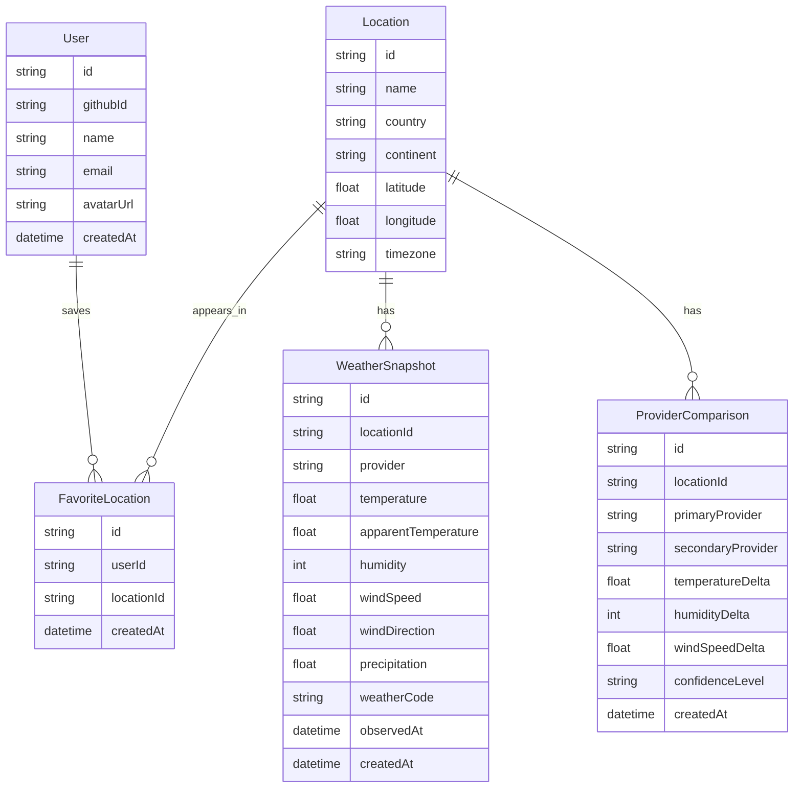

# Backend, MER y base de datos

## Objetivo del backend

Centralizar el consumo de APIs climaticas, normalizar datos, aplicar cache y exponer una API propia estable para el frontend.

## Entidades principales

### User

Representa un usuario registrado en una fase posterior.

- `id`
- `githubId`
- `name`
- `email`
- `avatarUrl`
- `createdAt`

### Location

Representa una ciudad, coordenada o region consultada.

- `id`
- `name`
- `country`
- `continent`
- `latitude`
- `longitude`
- `timezone`

### WeatherSnapshot

Representa una lectura climatica normalizada.

- `id`
- `locationId`
- `provider`
- `temperature`
- `apparentTemperature`
- `humidity`
- `windSpeed`
- `windDirection`
- `precipitation`
- `weatherCode`
- `observedAt`
- `createdAt`

### ProviderComparison

Representa la comparacion entre fuentes climaticas.

- `id`
- `locationId`
- `primaryProvider`
- `secondaryProvider`
- `temperatureDelta`
- `humidityDelta`
- `windSpeedDelta`
- `confidenceLevel`
- `createdAt`

### FavoriteLocation

Representa ubicaciones guardadas por usuario.

- `id`
- `userId`
- `locationId`
- `createdAt`

## Relaciones MER

- Un `User` puede tener muchas `FavoriteLocation`.
- Una `Location` puede tener muchos `WeatherSnapshot`.
- Una `Location` puede tener muchas `ProviderComparison`.
- Una `FavoriteLocation` pertenece a un `User` y a una `Location`.

## Diagrama simple

## Politica de cache

- Clima actual: 10 a 15 minutos.
- Pronostico: 30 a 60 minutos.
- Geocodificacion: 24 horas.
- Comparaciones: se recalculan cuando cambian los snapshots base.

