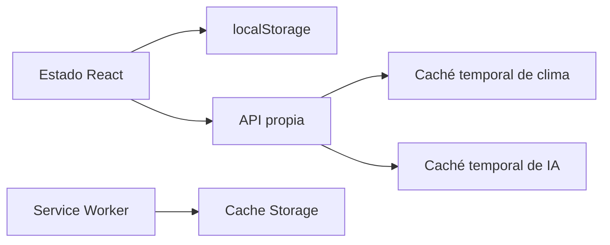

# Backend y persistencia

## Estado real

AppWeb Clima no usa base de datos, usuarios ni autenticación. El backend es un
servicio sin persistencia permanente que valida solicitudes, consulta
Open-Meteo, compara modelos y genera opcionalmente un resumen con Gemini.

## Componentes

- Adaptadores Express para desarrollo y Vercel Functions para producción.
- Casos de uso HTTP compartidos en `server/weatherHttp.ts`.
- Servicio meteorológico con validación runtime y caché temporal.
- Servicio IA con timeout, límite de tokens, caché y degradación independiente.
- Rate limit en memoria, cabeceras de seguridad y logs estructurados sin PII.

## Modelo de estado

```mermaid
flowchart LR
    React["Estado React"] --> Local["localStorage"]
    React --> API["API propia"]
    API --> Weather["Caché temporal de clima"]
    API --> AI["Caché temporal de IA"]
    PWA["Service Worker"] --> Cache["Cache Storage"]
```

| Medio | Contenido | Persistencia |
|---|---|---|
| React | Datos y estados de UI | Sesión actual |
| `localStorage` | Favoritos, recientes y movimiento | Hasta borrado |
| Memoria backend | Cachés y rate limit | Vida de la instancia |
| Cache Storage | Shell PWA | Hasta actualización/limpieza |

No se presenta un MER porque no existen entidades persistidas en una base de
datos. Si en el futuro se añaden cuentas o sincronización, esa decisión deberá
volver a Producto y Arquitectura antes de crear un esquema.
